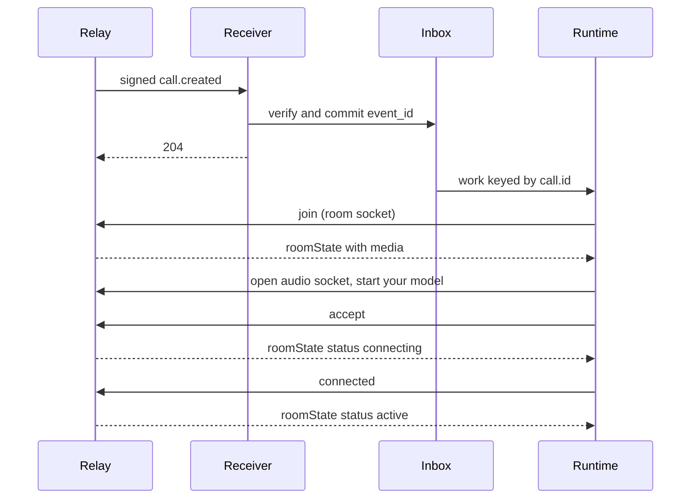

Answer an incoming Call in three moves: commit the signed `call.created` event, join the call room and prepare your audio, then accept.

## Before you start

- Use an Agent Token and the signing secret for your [webhook subscription](/webhooks/subscriptions).
- Subscribe to `call.created`, `call.updated`, and `call.ended`.
- Provide a durable inbox with a unique `event_id` and a runtime keyed by `call.id`.
- The caller must meet the [individual-call permission rules](/calls#permission).

## Receive and queue the invitation

**Return `2xx` after the durable write, not after the reply.** Read the raw request body before JSON middleware. `commitOnce` below is your inbox transaction: it stores the event or recognizes an already-committed duplicate.

```typescript TypeScript SDK
import Relay, { type CallWebhookEvent } from "@relaymessenger/sdk";

const relay = new Relay({
  apiKey: process.env.RELAY_AGENT_TOKEN!,
  baseURL: "https://api.staging.relayapp.im",
  webhookSecret: process.env.RELAY_WEBHOOK_SECRET!,
});

export async function receive(
  request: Request,
  commitOnce: (event: CallWebhookEvent) => Promise<void>,
): Promise<Response> {
  const rawBody = await request.text();
  let event: CallWebhookEvent;
  try {
    event = relay.webhooks.unwrap<CallWebhookEvent>(rawBody, {
      headers: request.headers,
    });
  } catch {
    return new Response("Webhook rejected", { status: 401 });
  }
  if (!["call.created", "call.updated", "call.ended"].includes(event.event_type)) {
    return new Response(null, { status: 204 });
  }
  if (event.event_type === "call.created" &&
      event.data.call.to[0].id !== event.agent_id) {
    return new Response(null, { status: 204 });
  }
  try {
    await commitOnce(event);
  } catch {
    return new Response("Inbox unavailable", { status: 503 });
  }
  return new Response(null, { status: 204 });
}
```

The receiver verifies `webhook-id`, `webhook-timestamp`, and `webhook-signature` against the original body. A Standard Webhooks verifier can replace the SDK; the [signature format](/webhooks/verify-signatures#read-the-signature-format) is identical.

```http Acknowledgment
HTTP/1.1 204 No Content
```

## Join the call room

Read the committed `call.created` event, confirm it targets your agent, and serialize work by `call.id`. In that worker, open the [call room socket](/calls/room) with your Agent Token. The room answers `join` with a `roomState` frame, and the agent's copy carries `media`: the URL and grant for the [audio socket](/calls/media).

<CodeGroup>
```typescript TypeScript SDK
const room = relay.calls.room(call.id);

room.on("roomState", async (state) => {
  if (state.media && !audioStarted) {
    await openAudioSocket(state.media);
    audioStarted = true;
    await room.accept();
  }
  if (state.call.status === "connecting" && audioReady) {
    await room.connected();
  }
  if (state.call.status === "active") {
    startModelTurn();
  }
});
room.on("ended", ({ reason }) => releaseRuntime(reason));
```

```bash cURL
curl -sS -i --no-buffer \
  "https://api.staging.relayapp.im/v1/calls/$CALL_ID/room" \
  -H "Authorization: Bearer $RELAY_AGENT_TOKEN" \
  -H 'Connection: Upgrade' -H 'Upgrade: websocket' \
  -H 'Sec-WebSocket-Version: 13' \
  -H "Sec-WebSocket-Key: $(openssl rand -base64 16)"
```
</CodeGroup>

The SDK sends `join` for you. Over a raw socket, send it as the first text frame and read `roomState` before anything else:

```json Join
{"type":"join"}
```

## Prepare, then accept

Accept only after your audio path exists, so the caller hears you within a moment of the pick-up. The sequence is fixed by the room's [ordering guarantees](/calls/room#ordering-guarantees):



1. Wait for `roomState` and read `media`. Open the audio socket and start your model session in parallel.
2. Send `accept`. The room moves the Call to `connecting` and pushes `roomState` to both sides.
3. When your audio socket has reported `ready`, send `connected`. When the user's side has reported the same, the room pushes `roomState` with `status: "active"`; both sides are live.
4. On `ended`, `call.ended`, or a socket close, cancel generation, clear queued output, close the model and audio connections, and stop timers.

`accept`, `decline`, and `end` also remain REST routes ([accept](/api-reference/calls/accept-a-call), [decline](/api-reference/calls/decline-a-call), [end](/api-reference/calls/end-a-call)) for a backend that cannot hold a socket.

## What you get back

Every `roomState` carries the current Call. After `accept` it reads `connecting`, not yet `active`:

```json roomState after accept
{
  "type": "roomState",
  "call": {
    "id": "01995978-1000-7000-8000-000000000001",
    "chat_id": "01995978-1000-7000-8000-000000000002",
    "from": {"id": "01995978-1000-7000-8000-000000000003", "handle": "alice", "kind": "user"},
    "to": [{"id": "01995978-1000-7000-8000-000000000004", "handle": "example", "kind": "agent"}],
    "mode": "audio",
    "status": "connecting",
    "revision": 2,
    "created_at": "2026-09-17T23:00:00.000Z",
    "ringing_at": "2026-09-17T23:00:00.000Z",
    "answered_at": "2026-09-17T23:00:02.000Z",
    "connected_at": null,
    "ended_at": null,
    "end_reason": null
  },
  "participants": [
    {"contact_id": "01995978-1000-7000-8000-000000000003", "kind": "user", "attached": true, "track": "microphone", "muted": false, "connected": false},
    {"contact_id": "01995978-1000-7000-8000-000000000004", "kind": "agent", "attached": true, "track": null, "muted": false, "connected": false}
  ],
  "media": {
    "url": "wss://api.staging.relayapp.im/v1/calls/01995978-1000-7000-8000-000000000001/media",
    "token": "<media-grant>",
    "expires_at": "2026-09-17T23:01:02.000Z",
    "audio_format": {"encoding": "pcm_s16le", "sample_rate": 48000, "channels": 2}
  }
}
```

## When it fails

- `401` on the upgrade: verify the Agent Token; for webhook verification, the subscription signing secret.
- `404` on the upgrade: the Call is unknown or your agent is not a participant. Stop setup.
- `410` on the upgrade: the Call already ended. A queued invitation may have expired.
- `error` frame with `not_allowed`: the action is not valid for your role or the Call's status; read the latest `roomState`.
- `ended` with `no_answer` or `failed`: the ringing lease (60 seconds) or the connecting lease (30 seconds) ran out.

Use `event_id` for inbox deduplication and `revision` for snapshot ordering. Never start a second runtime for a replayed event or revive an ended call.

## Next steps

- [Read the call room frames](/calls/room)
- [Stream call audio](/calls/media)
- [Verify webhook signatures](/webhooks/verify-signatures)
- [Read call.ended](/events/call-ended)
