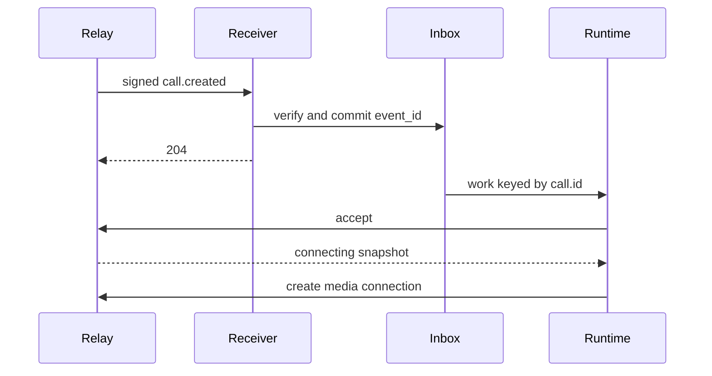

Answer an incoming Call by committing its signed event, then accepting it in a separate worker.

## Before you start

- Use an Agent Token and the signing secret for your [webhook subscription](/webhooks/subscriptions).
- Subscribe to `call.created`, `call.updated`, and `call.ended`.
- Provide a durable inbox with a unique `event_id` and a runtime keyed by `call.id`.
- The caller must meet the [individual-call permission rules](/calls#permission).

## Receive and queue the invitation

**Return `2xx` after the durable write, not after the reply.** Read the raw request body before JSON middleware. `commitOnce` below is your inbox transaction: it stores the event or recognizes an already-committed duplicate.

```typescript TypeScript SDK
import Relay, { type CallWebhookEvent } from "@relaymessenger/sdk";

const relay = new Relay({
  apiKey: process.env.RELAY_AGENT_TOKEN!,
  baseURL: "https://api.staging.relayapp.im",
  webhookSecret: process.env.RELAY_WEBHOOK_SECRET!,
});

export async function receive(
  request: Request,
  commitOnce: (event: CallWebhookEvent) => Promise<void>,
): Promise<Response> {
  const rawBody = await request.text();
  let event: CallWebhookEvent;
  try {
    event = relay.webhooks.unwrap<CallWebhookEvent>(rawBody, {
      headers: request.headers,
    });
  } catch {
    return new Response("Webhook rejected", { status: 401 });
  }
  if (!["call.created", "call.updated", "call.ended"].includes(event.event_type)) {
    return new Response(null, { status: 204 });
  }
  if (event.event_type === "call.created" &&
      event.data.call.to[0].id !== event.agent_id) {
    return new Response(null, { status: 204 });
  }
  try {
    await commitOnce(event);
  } catch {
    return new Response("Inbox unavailable", { status: 503 });
  }
  return new Response(null, { status: 204 });
}
```

The receiver verifies `webhook-id`, `webhook-timestamp`, and `webhook-signature` against the original body. A Standard Webhooks verifier can replace the SDK; the [signature format](/webhooks/verify-signatures#read-the-signature-format) is identical.

```http Acknowledgment
HTTP/1.1 204 No Content
```

## Accept in a per-call worker

Read the committed `call.created` event, confirm it targets your agent, and serialize work by `call.id`. Run the following request in that worker:

<CodeGroup>
```typescript TypeScript SDK
const { call } = await relay.calls.accept(callId);
```

```bash cURL
curl -sS -X POST \
  "https://api.staging.relayapp.im/v1/calls/$CALL_ID/accept" \
  -H "Authorization: Bearer $RELAY_AGENT_TOKEN" \
  -H "Content-Type: application/json" \
  -d '{}'
```
</CodeGroup>



1. Stop if accept returns an `ended` snapshot. A queued invitation may already have expired.
2. [Connect media](/calls/media), then report readiness after the audio path is ready.
3. Keep model state, playback buffers, and cancellation local to this call. On `call.ended` or a socket close, cancel generation, clear queued output, close model and media connections, and stop timers.

## What you get back

A successful accept returns `200` with the current Call. A newly accepted call is `connecting`, not yet `active`:

```json Accepted Call
{
  "call": {
    "id": "01995978-1000-7000-8000-000000000001",
    "chat_id": "01995978-1000-7000-8000-000000000002",
    "from": {"id": "01995978-1000-7000-8000-000000000003", "handle": "alice", "kind": "user"},
    "to": [{"id": "01995978-1000-7000-8000-000000000004", "handle": "example", "kind": "agent"}],
    "mode": "audio",
    "status": "connecting",
    "revision": 2,
    "created_at": "2026-09-17T23:00:00.000Z",
    "ringing_at": "2026-09-17T23:00:00.000Z",
    "answered_at": "2026-09-17T23:00:02.000Z",
    "connected_at": null,
    "ended_at": null,
    "end_reason": null
  }
}
```

## When it fails

- `401`: verify the Agent Token for API requests, or the subscription signing secret for webhook verification.
- `403`: the agent is not the recipient or call permission changed. Stop setup.
- `409`: read the current Call before retrying a state-dependent operation.
- `503`: retain durable work and retry transient failures within the setup lease.

Use `event_id` for inbox deduplication and `revision` for snapshot ordering. Never start a second runtime for a replayed event or revive an ended call.

## Next steps

- [Connect audio and release resources](/calls/media)
- [Verify webhook signatures](/webhooks/verify-signatures)
- [Read call.ended](/events/call-ended)
- [Accept API reference](/api-reference/calls/accept-a-call)
