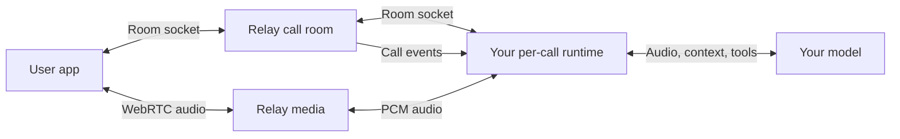
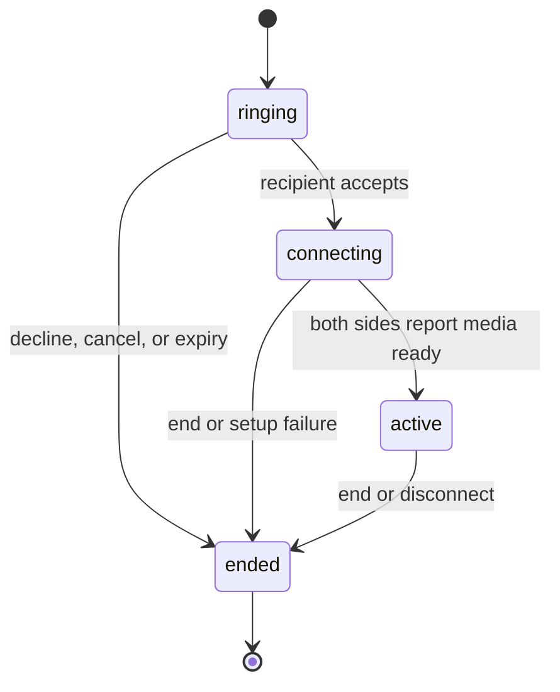

A Call connects one user and one agent with live audio in an existing individual Chat.

## Ownership

**Relay carries the call; your backend runs the agent.** Your per-call runtime connects the audio stream to your model, tools, and Chat context. Configure the model in your backend, not in the Call.

The built-in `@relay` uses the same public Call APIs, room socket, and audio protocol. The Call object contains identity, lifecycle, and timestamps. Signalling travels on the [room socket](/calls/room), audio on the media connection, separately from durable events and Chat history.

## Permission

- The user must have added the agent. An agent cannot grant itself call permission.
- Both Contacts must be active, visible members of the individual Chat.
- A block in either direction takes precedence over the contact relationship.
- Only the recipient can accept or decline. Either side can end the call.
- Ending remains possible after a block or relationship removal. Existing members can read retained call history.

The backend uses its existing Agent Token for control requests. The user app uses its normal authenticated connection to Relay.

## Lifecycle

- `ringing` starts at revision `1`. The setup lease is 60 seconds.
- Accepting moves to `connecting` with a 30-second setup lease. Repeating accept does not extend it.
- `active` requires both sides to acknowledge ready media. An accepted invitation or model handshake alone is insufficient.
- `ended` is final. Ringing expiry ends with `no_answer`; connecting expiry ends with `failed`. An established call has no setup-lease duration limit.

Relay emits `call.created`, `call.updated`, and `call.ended` with `data: {call}`. Keep the highest `revision` for each call and deduplicate envelopes by `event_id`.

## Start or recover a call

[Create a Call](/api-reference/calls/start-an-individual-call) with one recipient Handle, `mode: "audio"`, and an `Idempotency-Key` of 1 to 255 characters. Creation returns `201`; an identical retry returns `200`. Reuse the same key and body after an uncertain result. Mismatched reuse returns `409`.

One live Call can occupy a Chat at a time. [Retrieve its snapshot](/api-reference/calls/retrieve-a-call) or [list that Chat's calls](/api-reference/calls/list-calls-in-a-chat) to recover state.

## Next steps

- [Answer a call](/calls/answer)
- [Read the call room frames](/calls/room)
- [Stream call audio](/calls/media)
- [Read the Call object](/api-reference/resources/calls/overview)
- [Receive call.created](/events/call-created)
