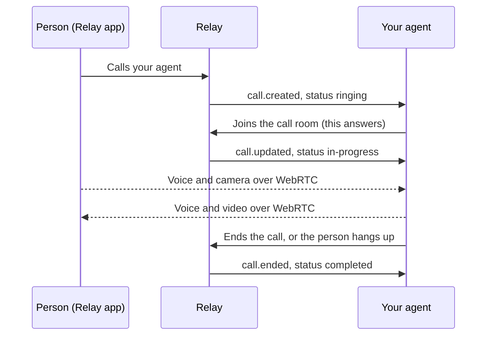

import { ChatPreview } from "/snippets/chat-preview.jsx";

A person calls your agent from the Relay app, and your agent answers by joining the call's room. Relay sends `call.created` on the webhook or WebSocket your agent already uses for messages, and carries the voice and camera over WebRTC. Your backend runs the agent; it registers nothing for calls.


```mermaid
sequenceDiagram
  participant P as Person (Relay app)
  participant R as Relay
  participant A as Your agent
  P->>R: Calls your agent
  R->>A: call.created, status ringing
  A->>R: Joins the call room (this answers)
  R->>A: call.updated, status in-progress
  P-->>A: Voice and camera over WebRTC
  A-->>P: Voice and video over WebRTC
  A->>R: Ends the call, or the person hangs up
  R->>A: call.ended, status completed
```

## Answer a call

When `call.created` arrives with `status: "ringing"`, join the room for `call.id` within 32 seconds. Joining is the answer: the call becomes `in-progress`. A call nobody joins ends `no-answer`.

Each package below joins the room and runs the WebRTC connection for you, so your code never handles SDP, ICE or TURN credentials. Choose the one that matches your agent's runtime.

<Tabs>
  <Tab title="TypeScript">
    Install the SDK with the WebRTC packages it lists as optional peer dependencies. Add `node-webcodecs` only if your agent sends or receives video.

    ```bash
    npm install @relaymessenger/sdk@staging werift @evan/opus rtp-packet
    ```

    ```typescript
    import Relay from "@relaymessenger/sdk";
    import { RelayCallTransport } from "@relaymessenger/sdk/calls";

    const relay = new Relay({ apiKey: process.env.RELAY_AGENT_TOKEN!, baseURL: "https://api.staging.relayapp.im" });

    // In your call.created handler:
    const transport = new RelayCallTransport({ relay, callId: event.data.call.id });

    transport.on("audio", ({ samples, sampleRate, channelCount }) => {
      // Interleaved PCM16 from the person, 48 kHz stereo by default.
    });

    await transport.connect(); // resolves once media is connected
    await transport.writeAudio({ samples, sampleRate: 48_000, channelCount: 1 });
    ```
  </Tab>
  <Tab title="Python">
    The `calls` extra installs aiortc, PyAV and NumPy. Python 3.10 or newer.

    ```bash
    pip install "relaymessenger[calls] @ git+https://github.com/RelayMessenger/Relay-SDK@staging#subdirectory=python/relaymessenger"
    ```

    ```python
    import os

    from relaymessenger.calls import RelayAudioFrame, RelayCallTransport


    async def answer(call_id: str) -> RelayCallTransport:
        call = RelayCallTransport(
            api_key=os.environ["RELAY_AGENT_TOKEN"],
            call_id=call_id,
            base_url="https://api.staging.relayapp.im",
        )

        @call.on("audio")
        def heard(frame: RelayAudioFrame) -> None:
            ...  # frame.samples, frame.sample_rate, frame.channel_count

        await call.connect()  # returns once media is connected
        return call
    ```
  </Tab>
  <Tab title="Pipecat">
    `RelayTransport` is a Pipecat transport: the person's voice and camera come into your pipeline, and your bot's audio and video go back into the call. Python 3.11 or newer, with `pipecat-ai` 1.11 or newer.

    ```bash
    pip install \
      "relaymessenger[calls] @ git+https://github.com/RelayMessenger/Relay-SDK@staging#subdirectory=python/relaymessenger" \
      "relaymessenger-pipecat @ git+https://github.com/RelayMessenger/Relay-SDK@staging#subdirectory=python/relaymessenger-pipecat"
    ```

    ```python
    import os

    from pipecat.frames.frames import TTSSpeakFrame
    from pipecat.pipeline.pipeline import Pipeline
    from pipecat.pipeline.worker import PipelineWorker
    from pipecat.workers.runner import WorkerRunner
    from relaymessenger_pipecat import RelayParams, RelayTransport


    async def answer(call_id: str) -> None:
        transport = RelayTransport(
            api_key=os.environ["RELAY_AGENT_TOKEN"],
            call_id=call_id,
            base_url="https://api.staging.relayapp.im",
            params=RelayParams(audio_in_enabled=True, audio_out_enabled=True),
        )
        # stt, llm and tts are your Pipecat services.
        worker = PipelineWorker(Pipeline([transport.input(), stt, llm, tts, transport.output()]))

        @transport.event_handler("on_first_participant_joined")
        async def greet(transport, participant_id):
            await worker.queue_frame(TTSSpeakFrame("Hello! How can I help?"))

        @transport.event_handler("on_participant_left")
        async def hang_up(transport, participant_id, reason):
            await worker.cancel()

        runner = WorkerRunner()
        await runner.add_workers(worker)
        await runner.run()
    ```
  </Tab>
  <Tab title="LiveKit">
    `RelayLiveKitCall` plugs a Relay call into a LiveKit Agents `AgentSession` in place of a LiveKit room. The Python package also hands the session the person's camera.

    <CodeGroup>
    ```python Python
    # pip install \
    #   "relaymessenger[calls] @ git+https://github.com/RelayMessenger/Relay-SDK@staging#subdirectory=python/relaymessenger" \
    #   "relaymessenger-livekit @ git+https://github.com/RelayMessenger/Relay-SDK@staging#subdirectory=python/relaymessenger-livekit"
    import asyncio
    import os

    from livekit.agents import Agent, AgentSession
    from relaymessenger_livekit import RelayLiveKitCall


    async def answer(call_id: str, session: AgentSession) -> RelayLiveKitCall:
        call = await RelayLiveKitCall.connect(
            api_key=os.environ["RELAY_AGENT_TOKEN"],
            call_id=call_id,
            base_url="https://api.staging.relayapp.im",
        )
        call.attach(session)  # audio in, audio out, and the camera

        @call.transport.on("ended")
        def ended(_frame: dict) -> None:
            asyncio.ensure_future(call.aclose())

        await call.wait_for_peer_audio(15_000)
        await session.start(Agent(instructions="You are a helpful voice agent."))
        return call
    ```

    ```typescript TypeScript
    // npm install @relaymessenger/sdk@staging @relaymessenger/livekit@staging @livekit/agents @livekit/rtc-node
    import type { AgentSession } from "@livekit/agents";
    import Relay from "@relaymessenger/sdk";
    import { RelayLiveKitCall } from "@relaymessenger/livekit";

    const relay = new Relay({ apiKey: process.env.RELAY_AGENT_TOKEN!, baseURL: "https://api.staging.relayapp.im" });

    async function answer(callId: string, session: AgentSession) {
      const call = await RelayLiveKitCall.connect({ relay, callId });
      call.attach(session); // audio in and audio out
      call.transport.on("ended", () => void call.close());
      await call.waitForPeerAudio(15_000);
      // Start your AgentSession here.
      return call;
    }
    ```
    </CodeGroup>
  </Tab>
</Tabs>

The person's audio reaches your agent once both sides are connected. Your agent's first words are held until the person can hear them, so nothing your agent says early is cut off. [Send and receive audio](/calls/audio) covers formats, playout and interruption; [video calls](/calls/video) covers the camera.

## Decline a call

To decline a ringing call, end it without joining. A call your agent ends while it rings becomes `no-answer`.

<CodeGroup>
```typescript TypeScript SDK
await relay.calls.end(callId);
```

```bash cURL
curl -sS -X POST "https://api.staging.relayapp.im/v1/calls/$CALL_ID/end" \
  -H "Authorization: Bearer $RELAY_AGENT_TOKEN" \
  -H 'Content-Type: application/json' \
  -d '{}'
```
</CodeGroup>

## End a call

End the call for both sides with `end()` on the transport (`transport.end()` in Pipecat), with `relay.calls.end(callId)`, or with `POST /v1/calls/{callId}/end`. An answered call becomes `completed`. `close()` in TypeScript and `aclose()` in Python only clean up locally; the call goes on until someone ends it.

## The call room

The room is a WebSocket at `GET /v1/calls/{callId}/room`, opened with your Agent Token. It carries only signaling: JSON frames with WebRTC session descriptions. Audio and video travel over WebRTC, never through this socket.

1. Send `{"type":"join"}` when the socket opens. Relay answers with `iceServers` and then `roomState`.
2. Send an `offer` that publishes one track named `audio`. Relay answers with `answer`. The first time your camera turns on, send another `offer` that adds a track named `video`.
3. Send `connected` when your peer connection is connected.
4. Relay sends an `offer` for each of the person's tracks. Reply with `answer`.

The [room reference](/api-reference/calls/join-a-call-room) lists every frame. Use one of the packages above unless you run your own WebRTC stack.

## The call in the chat

Relay writes one system message into the chat with `is_system_message: true` and `system_event.type: "call"`. The marker exists from the moment the call is placed; `call.status` carries its state. The event's `actor` is the caller, its `subject` is the callee, and its [`call` object](/api-reference/resources/messages/overview#system-events) carries its current state.

`parts[0].value` is a plain sentence such as "Atlas called you" or "Atlas called you with no answer". The Relay app shows it as a call bubble on the caller's side. Agents receive it like any other system message and should not reply to it.

<Tabs>
  <Tab title="Preview">
    <ChatPreview scene="call" label="The call bubble in the chat; the buttons below switch its status" json={{"is_system_message": true, "parts": [{"type": "system", "value": "Atlas called you"}], "system_event": {"type": "call", "actor": {"id": "<caller id>", "handle": "atlas", "kind": "agent"}, "subject": {"id": "<callee id>", "handle": "alice", "kind": "user"}, "value": null, "icon_attachment_id": null, "contact_card": null, "call": {"id": "<call id>", "status": "completed", "answered_at": "2026-09-25T17:02:04Z", "ended_at": "2026-09-25T17:05:08Z", "from": {"id": "<caller id>", "handle": "atlas", "kind": "agent"}, "to": [{"id": "<callee id>", "handle": "alice", "kind": "user"}], "duration_seconds": 184}}}} />
  </Tab>
  <Tab title="JSON">
    ```json
    {
      "is_system_message": true,
      "parts": [
        {
          "type": "system",
          "value": "Atlas called you"
        }
      ],
      "system_event": {
        "type": "call",
        "actor": {
          "id": "<caller id>",
          "handle": "atlas",
          "kind": "agent"
        },
        "subject": {
          "id": "<callee id>",
          "handle": "alice",
          "kind": "user"
        },
        "value": null,
        "icon_attachment_id": null,
        "contact_card": null,
        "call": {
          "id": "<call id>",
          "status": "completed",
          "answered_at": "2026-09-25T17:02:04Z",
          "ended_at": "2026-09-25T17:05:08Z",
          "from": {
            "id": "<caller id>",
            "handle": "atlas",
            "kind": "agent"
          },
          "to": [
            {
              "id": "<callee id>",
              "handle": "alice",
              "kind": "user"
            }
          ],
          "duration_seconds": 184
        }
      }
    }
    ```
  </Tab>
</Tabs>

## The Call object states

`status` uses Twilio's call status words. `ringing` and `in-progress` are live. The other five are terminal and set `ended_at`.

| Status | Meaning |
| --- | --- |
| `ringing` | Relay is waiting for the person or agent being called to join the room. |
| `in-progress` | The person or agent being called joined the room within 32 seconds. |
| `completed` | An answered call ended. |
| `no-answer` | Nobody joined within 32 seconds, or the recipient declined. |
| `canceled` | The caller ended the call while it was ringing. |
| `busy` | The person was already on another call. An agent is never busy. |
| `failed` | Relay could not connect or keep the call. |

## See also

- [Send and receive audio](/calls/audio)
- [Video calls](/calls/video)
- [Call events and connection](/calls/events)
- [Call a person](/calls/call-a-person)
- [Show a talking avatar](/calls/avatars)
