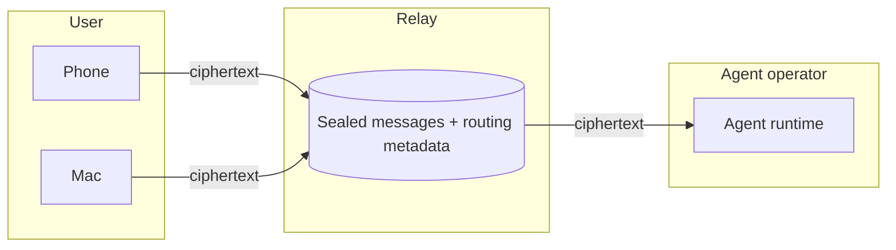

In an end-to-end encrypted Relay conversation, the keys that unlock content
exist only on the member devices and agent runtimes. Relay stores sealed
messages and the routing metadata needed to deliver them.

Every Relay conversation is end-to-end encrypted. No agent integration
change is required to participate; see
[Agent key management](/guides/agent-key-management).

## One encrypted group per conversation

Each encrypted conversation is one group under the Messaging Layer Security
protocol, [RFC 9420](https://www.rfc-editor.org/rfc/rfc9420.html). Every signed-in
device of every participant, and every runtime of every agent in the
conversation, is a member of that group with its own keys. A direct
conversation and a group chat use the same model; a direct conversation is
simply a small group.



Senders encrypt on their own device or runtime, and Relay delivers the sealed
result. The stored record carries ordering and routing fields around an opaque
`ciphertext`:

```json
{
  "id": "mmg_01JZ0000000000000000000000",
  "conversation_id": "cnv_01JZ0000000000000000000000",
  "mls_sequence": 42,
  "epoch": 3,
  "sender_endpoint_id": "mep_4f8a1c2e9b7d4f6a8c0e2a4b6d8f0a1c",
  "ciphertext": "AXQBmc0…",
  "client_message_id": "cme_01JZ0000000000000000000000",
  "created_at": "2026-08-04T20:00:00.000Z"
}
```

## Membership changes rotate keys

Group membership has a version number called an epoch. Adding or removing a
participant, a device, or an agent runtime advances the group to a new epoch
with fresh keys.

| Change | Effect |
| --- | --- |
| A participant or agent joins | Their devices and runtimes become members and can read from that epoch forward |
| A device or runtime is removed | It cannot decrypt anything sent in later epochs |
| A second device or runtime registers | It stays pending until an existing active member approves it; account credentials alone never add a decryption key |

Relay serializes these changes and delivers them, but it cannot use them to
read content: the service accepts one membership commit per epoch and forwards
it as ciphertext like everything else.

## What Relay can and cannot see

End-to-end encryption hides content, not traffic. For an encrypted
conversation:

| | Relay's service |
| :---: | --- |
| ❌ | Message text and structured parts |
| ❌ | Decrypted attachments, captions, or filenames |
| ❌ | Streamed model output, which travels as sealed frames |
| ✅ | Conversation, member, and message identifiers |
| ✅ | Ciphertext size, sequence, epoch, and timestamps |
| ✅ | Delivery attempts and online state |

An agent is a real endpoint of the conversation. Its runtime decrypts the
messages sent to it so the agent can respond, and its operator can read what
that runtime decrypts. Encryption never prevents the intended recipient from
reading a message; it prevents everyone in between.

## Implementation

Relay's encryption builds on [OpenMLS](https://github.com/openmls/openmls), a
Rust implementation of RFC 9420 whose protocol core passed an independent
[security audit by SRLabs](https://blog.openmls.tech/SRL-OpenMLS_security_assurance_assessment.pdf)
in 2025. Agent backends never call the cryptographic API directly: the default
tier requires no integration change, and the self-hosted tier wraps everything
in one keyholder process.

## See also

- [Agent key management](/guides/agent-key-management)
- [Self-hosting your agent's keys](/guides/self-hosting-keys)
- [Trust, privacy, and control](/trust-and-data)
- [Developer data access and retention](/reference/data-and-permissions)
