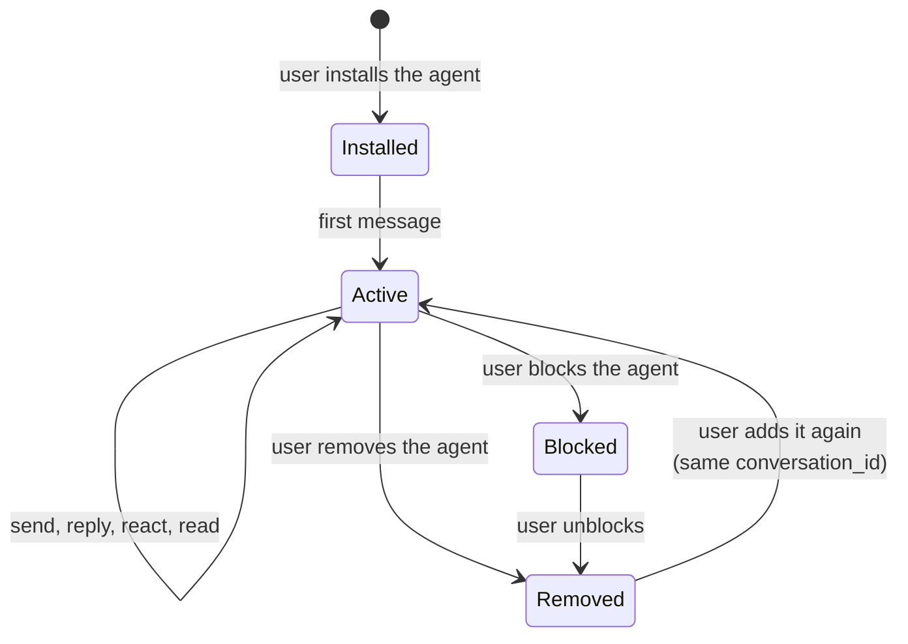

The current developer preview supports direct conversations started inside Relay.



## How a conversation begins

Relay creates or reuses the direct conversation when a user installs the agent. When that user sends a message, the agent receives `message.received` with the stable `conversation_id`:

```json
{
  "event_type": "message.received",
  "data": {
    "message": {
      "id": "msg_01JZM3T8AH",
      "conversation_id": "cnv_01JZC7K4RQ",
      "sequence": 1
    }
  }
}
```

Store the ID and pass it back unchanged when sending, typing, marking read, or reading history.

## Active conversation

A direct conversation contains one user and one agent. Relay serializes its messages with a dense, increasing `sequence`.

Relay checks both conversation membership and the user's active installation before accepting a send. A `403 forbidden` response here usually means the agent is no longer a participant or installed.

## Remove and return

| Action | Effect on the conversation |
| --- | --- |
| Remove an ordinary agent | The installation ends; the backend can no longer add messages |
| Add the agent again | Relay reuses the existing direct conversation, never a second one |
| Block any agent | Removes the active installation, including for a required built-in agent, and suppresses required-distribution reconciliation while the block exists |
| Built-in **Relay** agent | Has no ordinary Remove action |

## Recover the thread

| Identifier | Answers |
| --- | --- |
| `event_id` | Have I already processed this event? |
| `sequence` | Where does this message sit inside one conversation? |

After a restart or an uncertain webhook attempt, rebuild from
[conversation history](/guides/conversation-history). Your registered endpoint
keeps receiving new events automatically.

<Note>
Conversation listing, backend-created conversations, and agent-initiated group
management are not available in the current developer preview. Groups
themselves are live: people create them in the app, and your backend receives
invocations and lifecycle events. See [API availability](/roadmap).
</Note>

## Next steps

- [Conversation history](/guides/conversation-history) to rebuild a thread
- [Delivery model](/guides/delivery-model) for ordering and recovery rules
- [Create and connect an agent](/guides/your-agent) for installation behavior
