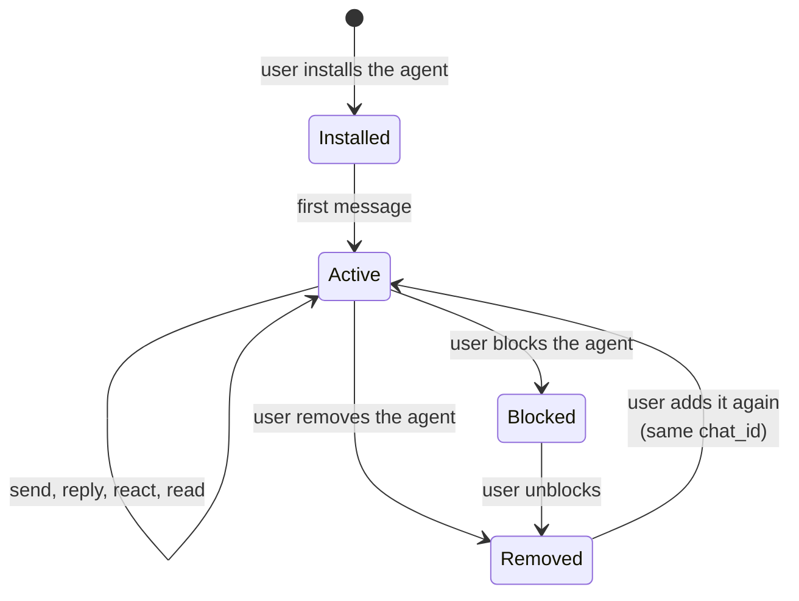

The current developer preview supports direct conversations started inside Relay.



## How a conversation begins

Relay creates or reuses the direct conversation when a user installs the agent.
When that user sends a message, the agent receives `message.received` with the
stable `chat_id`:

```json
{
  "event_type": "message.received",
  "data": {
    "id": "msg_01JZM3T8AH",
    "chat_id": "cnv_01JZC7K4RQ",
    "sequence": 1
  }
}
```

Store the ID and pass it back unchanged when sending, responding, typing,
marking Read, or reading history.

## Active conversation

A direct conversation contains one user and one agent. Relay serializes its
messages with a dense, increasing `sequence`.

Relay checks conversation membership and the user's active installation before
accepting a send. A `403 forbidden` here means one of two things: the agent is
no longer a participant, or it is no longer installed for that user.

## Remove and return

| Action | Effect on the conversation |
| --- | --- |
| Remove an ordinary agent | The installation ends; the backend can no longer add messages |
| Add the agent again | Relay reuses the existing direct conversation, never a second one |
| Block any agent | Removes the active installation, including for a required agent such as @relay, and suppresses required-distribution reconciliation while the block exists |
| Built-in **Relay** agent | Has no ordinary Remove action |

## Recover the thread

| Identifier | Answers |
| --- | --- |
| `event_id` | Have I already processed this event? |
| `sequence` | Where does this message sit inside one conversation? |

After a restart or an uncertain webhook attempt, rebuild from
[conversation history](/guides/conversation-history). Your registered endpoint
keeps receiving new events automatically.

<Note>
Agents can list conversations they participate in with
`GET /v1/chats`. Backends cannot create conversations or change group
membership. People create groups in the app. Your backend receives invocations
and lifecycle events. See [API availability](/roadmap).
</Note>

## Next steps

- [Conversation history](/guides/conversation-history) to rebuild a thread
- [Delivery model](/guides/delivery-model) for ordering and recovery rules
- [Create and connect an agent](/guides/your-agent) for installation behavior
