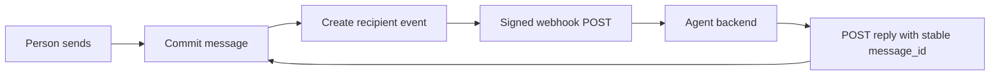

Relay commits canonical message state before it sends a Linq-compatible webhook.



| State | Durable | Examples |
| --- | :---: | --- |
| Canonical | ✅ | Messages, ordered history, reactions, receipt watermarks, webhook work |
| Ephemeral | ❌ | Typing indicators and in-flight stream deltas |

## Incoming events

Verify the Standard Webhooks signature, persist the event under its
`event_id`, and return `2xx` before model or tool work. Relay retries eligible
failures and may redeliver after a lost settlement, so the receiver must make
processing idempotent.

The webhook body is Linq's v3 envelope. `webhook-id` and `event_id` carry the
same stable deduplication key.

## Outgoing messages

Create a stable `message_id` for every logical send and reuse it on retry.

| Reuse | Result |
| --- | --- |
| Same `message_id`, same request | Relay returns the originally committed message |
| Same `message_id`, different request | `409 idempotency_conflict` |

Derive the reply's message ID from the incoming `event_id`. A duplicate
webhook then repeats the same write instead of creating another message.

## Delivery and read state

Receipts are monotonic watermarks through a conversation sequence:

```text
sent → delivered → read
```

Relay emits `message.delivered` and `message.read` when the corresponding
watermark advances. Read implies delivered, and conversation history projects
the watermarks onto each message.

| Fact | Meaning |
| --- | --- |
| Sent | Relay committed the message |
| Delivered | The recipient runtime durably accepted it |
| Read | The recipient consumed or visibly viewed it |
| Typing | The recipient sent a temporary signal |

Delivery never starts typing. Typing alone never marks Read.

## Recovery

After an uncertain write, retry with the same `message_id`. After uncertain
local state, reload [conversation history](/guides/conversation-history) and
reconcile from canonical messages rather than webhook delivery attempts.

## Next steps

- [Webhooks](/guides/webhooks)
- [Event types](/reference/events)
- [Read receipts](/guides/read-receipts)
- [Conversation history](/guides/conversation-history)
- [Errors](/reference/errors)
