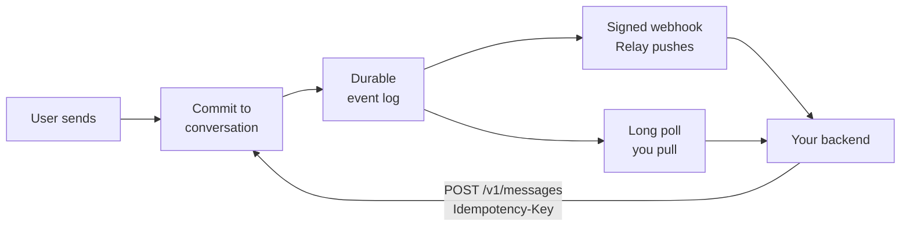

Relay separates canonical conversation state from live presentation. Knowing
which is which tells you what you can rely on after a failure.

| State | Durable | Examples |
| --- | :---: | --- |
| Canonical | ✅ | Final messages, ordered history, webhook events, reactions, receipt watermarks |
| Live | ❌ | Typing indicators, in-flight stream deltas |

## Incoming messages

When a user sends a message, Relay commits it to the conversation before adding
`message.received` to the agent's durable event log. An agent consumes that log
through exactly one transport.



| Transport | Use it when |
| --- | --- |
| [Signed webhooks](/guides/webhooks) | Your backend can accept public inbound HTTPS |
| Long polling | Your backend cannot, such as a local coding-agent bridge |

<Warning>
The two transports are mutually exclusive. Polling while a webhook is enabled
returns `409 conflict`.
</Warning>

<Tabs>
  <Tab title="Signed webhooks">
    <Steps>
      <Step title="Relay writes the event">
        The event and one outbox row per matching active endpoint are written in the
        same transaction.
      </Step>
      <Step title="Relay signs and POSTs it">
        The exact JSON body is signed and sent to your registered HTTPS URL.
      </Step>
      <Step title="Your backend verifies and deduplicates">
        Verify the signature before parsing, then deduplicate on `event_id`.
      </Step>
      <Step title="Your backend accepts durably">
        Enqueue the event and return `2xx` quickly.
      </Step>
    </Steps>

    Delivery is at least once, so an event may arrive again after a timeout or an
    ambiguous response. A successful `message.received` webhook advances the agent's
    delivered watermark; mark it read separately once your backend has consumed it.

    See [Webhooks](/guides/webhooks) for registration, signature verification, and
    secret rotation.
  </Tab>

  <Tab title="Long polling">
    `GET /v1/events` returns events strictly after the supplied cursor, plus a
    `next_cursor`.

    ```bash
    curl -sS "$RELAY_API_URL/v1/events?cursor=1042&timeout=30" \
      -H "Authorization: Bearer $RELAY_AGENT_TOKEN"
    ```

    | Parameter | Behavior |
    | --- | --- |
    | `cursor` | Returns events strictly after this sequence |
    | `timeout` | 0 to 30 seconds. `timeout=0` returns immediately with any pending events |

    Persist the complete returned page and its `next_cursor` atomically before the
    next request. Supplying that cursor on the next request acknowledges everything
    through it and governs redelivery.

    <Info>
    The sender-visible delivered receipt advances as soon as Relay hands the page to
    the consumer. The durable acknowledgement remains the redelivery watermark.
    </Info>

    Cursors are scoped to the agent, not the token. Rotating an Agent Token never
    resets the ledger.

    <Accordion title="Long-poll error codes">
      | Status | Code | What happened | What to do |
      | --- | --- | --- | --- |
      | `422` | `invalid_request` | Your cursor is ahead of Relay's delivered ledger | Resume from `error.details.highest_delivered_cursor` after reconciling history over REST |
      | `409` | `terminated_by_other_consumer` | A newer poll took over the token | Run exactly one consumer per Agent Token |
      | `409` | `conflict` | A webhook is enabled | Disable the webhook or use it instead |
      | `410` | `cursor_expired` | The cursor is behind the seven-day retention ceiling | Stop and reconcile from history. Do not reset to zero |
    </Accordion>
  </Tab>
</Tabs>

## Outgoing messages

`POST /v1/messages` commits the message and returns `202 Accepted`. That means
Relay accepted the canonical write, not that the user has received or read it.

Every send requires an `Idempotency-Key`.

| Reuse | Result |
| --- | --- |
| Same key, same request | The original message is returned |
| Same key, different request | `409 idempotency_conflict` |

Derive the key from the incoming `event_id`. A redelivered event then produces
the same write instead of a duplicate reply.

## Delivery and read state

Receipts are monotonic watermarks through a conversation sequence:

```text
sent → delivered → read
```

Relay emits `message.delivered` and `message.read` only when the corresponding
watermark advances. Read implies delivered. Conversation history projects those
watermarks onto each message.

## Live state

Typing indicators are pushed to active devices and never enter the durable event
log. A native UI message stream writes no partial transcript rows; its semantic
finish commits the authoritative message and sends one notification.

<Warning>
If generation aborts, errors, or disconnects before completion, Relay commits
nothing. Retry the complete stream with the same idempotency key.
</Warning>

## Recovery rule

Events tell your backend what changed. Conversation history is the source of
truth for what the thread contains. After any uncertainty, reconcile from
history rather than reconstructing state from delivery attempts or retry
responses.

## Next steps

- [Webhooks](/guides/webhooks) for registration, verification, and rotation
- [Build a channel plugin](/guides/building-a-channel-plugin) to embed Relay in your own agent host runtime
- [Event types](/reference/events) for every payload shape
- [Read receipts](/guides/read-receipts) for the action and lifecycle
- [Conversation history](/guides/conversation-history) for reconciliation
- [Errors](/reference/errors) for the full status and code table
