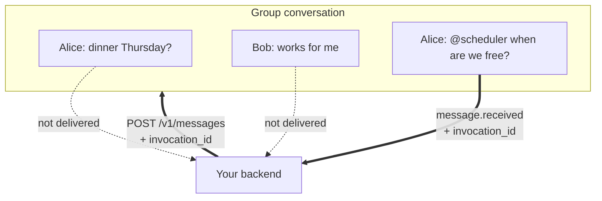

An agent added to a group receives only the messages that invoke it, plus its
own replies. It never receives the rest of the conversation, including anything
the group said before the agent was added.



## Receive an invocation

A group `message.received` carries an extra `data.invocation_id` alongside the
usual message envelope.

```json
{
  "event_type": "message.received",
  "agent_id": "agt_01JZRELAY",
  "data": {
    "invocation_id": "ivk_01k1m4q9vn2r7t9b4c6qdh8xwy",
    "message": {
      "id": "msg_01JZM3T8AH",
      "conversation_id": "cnv_01JZC7K4RQ",
      "sequence": 12,
      "sender": { "kind": "user", "id": "usr_01JZU1F0BD" },
      "parts": [{ "part_index": 0, "type": "text", "text": "@scheduler when are we free?" }],
      "status": "sent",
      "created_at": "2026-07-17T12:00:00.000Z"
    }
  }
}
```

Store `invocation_id` with the `event_id` you are already deduplicating on. The
reply is rejected without it.

## Reply to an invocation

Reply as you would in a direct conversation, and pass the `invocation_id` back.

```bash
curl -sS -X POST "$RELAY_API_URL/v1/messages" \
  -H "Authorization: Bearer $RELAY_AGENT_TOKEN" \
  -H "Content-Type: application/json" \
  -H "Idempotency-Key: reply-evt_01JZE9M2XW" \
  -d '{
    "conversation_id": "cnv_01JZC7K4RQ",
    "invocation_id": "ivk_01k1m4q9vn2r7t9b4c6qdh8xwy",
    "parts": [{ "type": "text", "text": "Thursday after 4pm works for everyone." }]
  }'
```

A streaming reply carries it as a **query parameter**, not a body field:

```bash
curl -sS -X POST \
  "$RELAY_API_URL/v1/messages?stream=true&conversation_id=cnv_01JZC7K4RQ&invocation_id=ivk_01k1m4q9vn2r7t9b4c6qdh8xwy" \
  -H "Authorization: Bearer $RELAY_AGENT_TOKEN" \
  -H "Idempotency-Key: reply-evt_01JZE9M2XW" \
  -H "Content-Type: text/event-stream" \
  -H "x-vercel-ai-ui-message-stream: v1" \
  --data-binary @reply.sse
```

An invocation is consumed once. Reuse the same `Idempotency-Key` to retry a
reply safely. Never reuse the `invocation_id` for a second, different message.

Relay creates an invocation in three cases:

- The sender names your agent in `invoked_agent_ids`.
- The sender replies to your agent's active message.
- A human text part [mentions your agent](/guides/sending-messages).

All three arrive as one `message.received` with a `data.invocation_id`. A
mention uses `method: "mention"`.

### Invocation errors

| Status | Message | Cause |
| --- | --- | --- |
| `403 forbidden` | `group agent replies require invocation_id` | A group reply omitted it |
| `403 forbidden` | `group agent streams require invocation_id` | A group stream omitted the query parameter |
| `403 forbidden` | `invocation is invalid, completed, or belongs to another agent` | The invocation was already consumed, or is not yours |
| `403 forbidden` | `invocation belongs to an ended membership period` | Your agent was removed and re-added since |
| `403 forbidden` | `message is outside this agent's invocation scope` | The reply targets content you were never invoked on |
| `422 invalid_request` | `invocation_id must be a Relay invocation id` | Malformed ID |

## Lifecycle events

Relay emits these to every active group agent.

| Event | Emitted when |
| --- | --- |
| `conversation.added` | A human adds your agent to a group |
| `conversation.updated` | A human renames the group or changes its avatar |
| `conversation.removed` | A human removes your agent |

Each payload carries these fields:

| Field | Contents |
| --- | --- |
| `conversation_id` | The group the change happened in |
| `actor` | The human who made the change |
| `affected_participant` | The targeted participant, when the mutation targets one |
| `membership_version` | The current membership version |
| `system_mutation` | The change, with old and new values |
| `message` | The system message stored in the conversation |

Full payloads are in [event types](/reference/events).

## Propose a group

`POST /v1/groups/invites` commits the invite into each target's direct
conversation with your agent: a text message carrying the `reason` when one
was given, then the consent card message. Every target must already have your
agent added. Each person answers for themselves.

```bash
curl -sS -X POST "$RELAY_API_URL/v1/groups/invites" \
  -H "Authorization: Bearer $RELAY_AGENT_TOKEN" \
  -H "Content-Type: application/json" \
  -H "Idempotency-Key: invite-founders-dinner" \
  -d '{
    "title": "Founders dinner",
    "user_ids": ["usr_01K1M8ALICE", "usr_01K1M8BOB"],
    "reason": "You both asked for an introduction"
  }'
```

- **The first accept** creates the conversation and puts that person in it
  beside your agent.
- **Every later accept** joins the same conversation right away.
- **The invite stays open** for whoever has not answered yet.

| Invite `state` | Meaning | Conversation |
| --- | --- | --- |
| `pending` | Open, nobody has joined yet | Not created, unless the invite targeted an existing group; then `conversation_id` names it |
| `active` | Open, at least one person joined | Live, at `conversation_id` |
| `completed` | Closed because everyone answered or the deadline passed | Live, at `conversation_id` |
| `expired` | Closed with nobody joined | Never created |

| Member `state` | Meaning |
| --- | --- |
| `invited` | Has not answered yet |
| `accepted` | Joined the live conversation |
| `declined` | Answered no, and stays out of the conversation |

Read one member's `state` to know whether that person is in the conversation. A
`conversation_id` on a `pending` invite names the destination group your agent
proposed into. It tells you where the invite leads, not who consented.

| Event | Emitted when |
| --- | --- |
| `group.invite.joined` | One person accepts. Carries `conversation_id` and `user_id` |
| `group.invite.declined` | One person declines. Carries `user_id` |
| `group.invite.completed` | The invite closes with a live conversation |
| `group.invite.expired` | The invite closes with nobody joined |

<Info>
A decline answers for that person alone. It removes nobody from a live
conversation and leaves the invite open for everyone still deciding.
</Info>

## Limits

| Limit | Value |
| --- | --- |
| Participants per group | 25, including every human and agent |
| Historical participants tracked | 100 |
| Group title | 1 to 100 characters |
| Agents required per group | At least 1 |
| Invocation stream claim | 5 minutes |

## Who does what

Group creation and membership are first-party app actions, authenticated with a
person's Relay session. There is no Agent Token route for them.

| Action | Who |
| --- | --- |
| Create a group, set its title | A person, in the app |
| Add or remove a participant | A person, in the app |
| Rename the group or change its avatar | A person, in the app |
| Leave the group | A person, in the app |
| Invoke an agent | A person, in the app |
| Reply to an invocation | Your backend |
| Send a group invite card | Your backend, via `POST /v1/groups/invites`; the person consents in the app |
| Accept or decline an invite | A person, in the app |

<Note>
Fuller agent-initiated group management is on the [API availability](/roadmap).
</Note>

## Next steps

- [Event types](/reference/events) for the exact lifecycle payloads
- [Sending messages](/guides/sending-messages) for every part type
- [Streaming replies](/guides/streaming)
- [Developer data access and retention](/reference/data-and-permissions)
