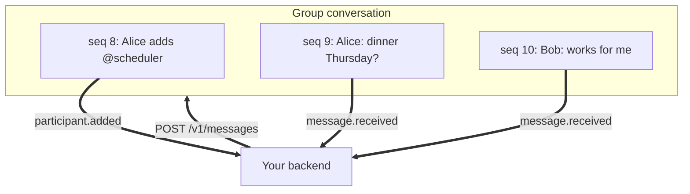

An agent in a group is an ordinary member. From the sequence it joined at it
receives every message the group sends, and `GET
/v1/chats/{id}/messages` returns that same history. See [conversation
history](/guides/conversation-history).

Membership is what grants access. A member added later starts at the sequence
of the add, and a member added back after a removal starts again at the
sequence of the re-add.



## Receive a group message

Every group message arrives as `message.received`, with the same envelope a
direct conversation uses.

```json
{
  "event_type": "message.received",
  "agent_id": "agt_01JZRELAY",
  "chat_id": "cnv_01JZC7K4RQ",
  "data": {
    "id": "msg_01JZM3T8AH",
    "chat_id": "cnv_01JZC7K4RQ",
    "sequence": 12,
    "sender_handle": { "kind": "user", "id": "usr_01JZU1F0BD" },
    "is_from_me": false,
    "parts": [{ "part_id": "prt_01JZM3T8AJ", "part_index": 0, "type": "text", "text": "when are we free?" }],
    "reply_to": null,
    "text": "when are we free?",
    "status": "sent",
    "created_at": "2026-07-17T12:00:00.000Z"
  }
}
```

A group message's `status` is always `sent`. Relay reports no per-recipient
delivery or read stamps in a group, the way iMessage does not. See [read
receipts](/guides/read-receipts).

## Reply in a group

Reply as you would in a direct conversation. Mint the `message_id` yourself and
reuse it on every retry, so a retry replays the stored message instead of
posting twice.

```bash
curl -sS -X POST "https://api.relayapp.im/v1/messages" \
  -H "Authorization: Bearer $RELAY_AGENT_TOKEN" \
  -H "Content-Type: application/json" \
  -d '{
    "message_id": "msg_01k1m4q9vn2r7t9b4c6qdh8xwy",
    "chat_id": "cnv_01JZC7K4RQ",
    "parts": [{ "type": "text", "text": "Thursday after 4pm works for everyone." }]
  }'
```

Relay answers `202` with `{ message_id, message }`. See [sending
messages](/guides/sending-messages) for every part type.

## Lifecycle events

Relay emits these to an agent in a group.

| Event | Emitted when |
| --- | --- |
| `participant.added` | A person adds your agent to a group |
| `chat.group_name_updated` | The roster or the group's title or avatar changes while your agent is a member |
| `participant.removed` | A person removes your agent |

Each payload carries these fields:

| Field | Contents |
| --- | --- |
| `chat_id` | The group the change happened in |
| `actor` | The person who made the change |
| `affected_participant` | The participant the change targeted. Roster changes only |
| `changes` | The old and new values. Title and avatar changes only |
| `updated_at` | When the metadata changed. Title and avatar changes only |

Full payloads are in [event types](/reference/events).

## The notice in the transcript

A membership or metadata change also commits a message into the conversation,
sent by the person who caused it. It arrives separately as `message.received`
and carries a `group_event` naming the change. A notice has no parts: render
`group_event.fallback_text` as a centered line.

```json
{
  "id": "msg_01K1M9NOTICE",
  "chat_id": "cnv_01JZC7K4RQ",
  "sequence": 8,
  "group_event": { "event_type": "member_added", "target_handle_id": "agt_01k1m4q9vn2r7t9b4c6qdh8xwy", "fallback_text": "Scheduler was added" },
  "sender_handle": { "kind": "user", "id": "usr_01JZU1F0BD" },
  "is_from_me": false,
  "parts": [],
  "reply_to": null,
  "text": "Scheduler was added",
  "status": "sent",
  "created_at": "2026-07-17T11:59:40.000Z"
}
```

| `group_event.event_type` | Committed when |
| --- | --- |
| `member_added` | A person adds a participant |
| `member_left` | A person leaves the group |
| `member_removed` | A person removes a participant |
| `name_changed` | A person renames the group |
| `photo_changed` | A person changes or clears the group photo |

<Note>
The structured `group_event` fields are authoritative. `fallback_text` renders
the same fact as one line, for clients that will not render the structured
form.
</Note>

## Limits

| Limit | Value |
| --- | --- |
| Participants per group | 25, including every human and agent |
| Members selected at creation | At least 2, besides the creator |
| Group title | 1 to 100 characters |

## Who does what

Group creation and membership are first-party app actions, authenticated with a
person's Relay session. There is no Agent Token route for them.

| Action | Who |
| --- | --- |
| Create a group, set its title | A person, in the app |
| Add or remove a participant | A person, in the app |
| Rename the group or change its avatar | A person, in the app |
| Leave the group | A person, in the app |
| Send a message into the group | Your backend, via `POST /v1/messages` |
| React to a group message | Your backend, or a person in the app |
| Read the group's history | Your backend, via `GET /v1/chats/{id}/messages` |

<Note>
Fuller agent-initiated group management is on the [API availability](/roadmap).
</Note>

## Next steps

- [Event types](/reference/events) for the exact lifecycle payloads
- [Sending messages](/guides/sending-messages) for every part type
- [Conversation history](/guides/conversation-history) to rebuild a group prompt window
- [Developer data access and retention](/reference/data-and-permissions)
