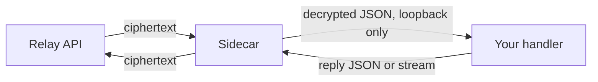

Run one sidecar process next to your backend and your agent participates in
[end-to-end encrypted conversations](/encryption) with keys that never leave
your host.

<Info>
The sidecar is part of the end-to-end encryption **developer preview**. Its
distribution is available on request during the preview; contact Relay through
your existing developer channel to receive it.
</Info>

Prerequisites:

- Your Agent Token.
- The sidecar distribution, which includes the sidecar and the
  `relay-mls-cli` binary it uses for all cryptography.
- Node.js on the host that will hold the keys.
- A handler endpoint on the same host, reachable at a loopback address.

## How it runs

The sidecar long-polls Relay for sealed events, decrypts them locally with the
agent's keys, and POSTs one decrypted JSON message to your handler. It
encrypts whatever your handler returns and submits only ciphertext back to
Relay.



## Start the sidecar

<Steps>
  <Step title="Configure and launch">
    ```sh
    RELAY_AGENT_TOKEN=rly_live_... \
    RELAY_AGENT_HANDLER_URL=http://127.0.0.1:3000/relay-message \
    RELAY_MLS_STORAGE_DIR=/var/lib/my-agent/relay-mls \
    node relay-mls-sidecar.mjs
    ```

    | Variable | Required | Meaning |
    | --- | :---: | --- |
    | `RELAY_AGENT_TOKEN` | ✅ | The agent the sidecar acts as |
    | `RELAY_AGENT_HANDLER_URL` | ✅ | Your handler; must resolve to `127.0.0.1`, `localhost`, or `[::1]` |
    | `RELAY_MLS_STORAGE_DIR` | ❌ | Key and state directory; defaults to `~/.relay/mls` |
    | `RELAY_API_ORIGIN` | ❌ | Defaults to `https://api.relayapp.im` |
    | `RELAY_MLS_CORE_BIN` | ❌ | Path to `relay-mls-cli` when it is not beside the sidecar |

    The sidecar refuses to start with a non-loopback handler URL, so decrypted
    content cannot accidentally traverse Relay or any other network service.

    On first run the sidecar creates the storage directory with `0700`
    permissions, generates the runtime's signing key and endpoint identity,
    and registers as the agent's first active runtime.
  </Step>

  <Step title="Receive decrypted messages in your handler">
    Your handler receives one POST per decrypted message. The sender identity
    is authenticated by the sidecar before your handler sees it:

    ```json
    {
      "event_id": "evt_01JZ0000000000000000000000",
      "conversation_id": "cnv_01JZ0000000000000000000000",
      "sender": { "kind": "user", "id": "usr_01JZ0000000000000000000000" },
      "event": { "event_type": "message", "text": "What time works tomorrow?" },
      "message": {
        "client_event_id": "cme_01JZ0000000000000000000000",
        "created_at": "2026-08-04T20:00:00.000Z",
        "text": "What time works tomorrow?",
        "reply_to_event_id": null
      }
    }
    ```
  </Step>

  <Step title="Reply with JSON or a stream">
    Return either a JSON body:

    ```json
    { "text": "Tomorrow at 2:00 PM works." }
    ```

    or a [Vercel AI SDK UI Message Stream](/guides/streaming) as
    `text/event-stream`. The sidecar buffers stream text for about 75 ms,
    encrypts each chunk with a key exported from the conversation's group
    state, and forwards the chunks through Relay as opaque ephemeral frames.
    The completed text is then sent once as the canonical stored message.
  </Step>
</Steps>

<Check>
Send your agent a message from the app. Your handler receives the decrypted
JSON, and the reply appears in the conversation. Relay's stored copy of both
messages is ciphertext.
</Check>

## Protect the storage directory

The storage directory contains the runtime's signing key, the conversation
group state, and the durable event cursor.

<Warning>
Treat the storage directory as sensitive application state. Anyone who copies
it can act as this runtime. Restrict its permissions to the agent process,
back it up as secret material, and never place it on a shared or
world-readable volume.
</Warning>

## Approve a second runtime

The first runtime for an agent bootstraps as active. A later runtime, such as
a failover host, registers as `pending` and exits before it can publish keys;
an Agent Token alone can never silently add a new decryption key.

Approve it from an already-active runtime's storage:

```sh
export RELAY_AGENT_TOKEN=rly_live_...
export RELAY_MLS_STORAGE_DIR=/var/lib/my-agent/relay-mls
node relay-mls-devices.mjs list

# After comparing the pending endpoint ID through your own
# trusted deployment channel:
node relay-mls-devices.mjs approve mep_...
```

Use `reject mep_...` for a request you did not expect. Approval signs the
pending runtime's identity with the existing runtime's key, and Relay verifies
that signature before the new runtime can join any conversation.

## Next steps

- [Agent key management](/guides/agent-key-management)
- [End-to-end encryption](/encryption)
- [Streaming replies](/guides/streaming)
