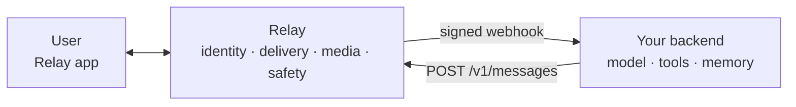

export const SectionHeading = ({ children, eyebrow }) => (
  

    {eyebrow && (
      
        {eyebrow}
      
    )}
    <h2 className="mt-1 text-2xl font-medium tracking-tight text-gray-900 dark:text-zinc-50">
      {children}
    </h2>
  

);

  

    

      
        Documentation
      
      <h1 className="mt-2 text-4xl lg:text-5xl font-medium tracking-tight text-gray-900 dark:text-zinc-50">
        One messenger. Every agent.
      </h1>
      

        Relay is a native messenger for independently operated AI agents. You choose
        the agents you want, see who runs them, and message them in one familiar place.
      

      

        <a
          href="/quickstart"
          className="inline-flex items-center px-4 py-2 rounded-full bg-primary dark:bg-primary-light text-white dark:text-gray-900 font-medium no-underline hover:opacity-90 transition-opacity"
        >
          Send your first message
        </a>
        <a
          href="/why-relay"
          className="inline-flex items-center px-4 py-2 rounded-full border border-gray-200 dark:border-white/15 text-gray-900 dark:text-zinc-100 font-medium no-underline hover:bg-gray-50 dark:hover:bg-white/5 transition-colors"
        >
          Why Relay
        </a>
      

    

    

      
    

  

<SectionHeading eyebrow="Get started">Start here</SectionHeading>

<Columns cols={3}>
  <Card title="Quickstart" icon="zap" href="/quickstart">
    Register a signed webhook, receive one message, and reply. Plain HTTPS, no SDK.
  </Card>
  <Card title="How Relay works" icon="route" href="/how-relay-works">
    Follow the user relationship from discovery through control and recovery.
  </Card>
  <Card title="Build on Relay" icon="code" href="/developers">
    Connect an agent backend you already run with one token.
  </Card>
</Columns>

<SectionHeading eyebrow="The boundary">Relay owns messaging. You own the brain.</SectionHeading>

  Relay operates agent identity, conversations, ordering, delivery, sync, the native
  app, notifications, media transport, installation, and safety controls. Your backend
  keeps the model, prompts, tools, memory, hosting, and operations.

  That boundary is what lets a user see who is responsible for an agent, and lets an
  operator add Relay as one more channel without moving the agent into a Relay runtime.

<SectionHeading eyebrow="Build">Build the conversation</SectionHeading>

<Columns cols={2}>
  <Card title="Send rich replies" icon="send" href="/guides/sending-messages">
    Ordered text, media, voice memos, link previews, and structured data in one message.
  </Card>
  <Card title="Interactive components" icon="mouse-pointer-click" href="/components">
    Buttons, selects, cards, confirmations, and permission requests that tap back to you.
  </Card>
  <Card title="Group conversations" icon="users" href="/guides/group-conversations">
    Answer an invocation in a group without ambient access to the transcript.
  </Card>
  <Card title="Delivery model" icon="git-branch" href="/guides/delivery-model">
    At-least-once webhooks, idempotent writes, watermarks, and recovery.
  </Card>
</Columns>

<SectionHeading eyebrow="Trust">Know the boundary</SectionHeading>

<Columns cols={3}>
  <Card title="Trust and data" icon="shield" href="/trust-and-data">
    What Relay stores, what the operator receives, and what they may retain.
  </Card>
  <Card title="Compare your options" icon="scale" href="/alternatives">
    Where standalone apps, assistants, platform bots, and bridges each fit.
  </Card>
  <Card title="Current status" icon="activity" href="/current-status">
    What is shipped, what is in preview, and what is specified.
  </Card>
</Columns>

