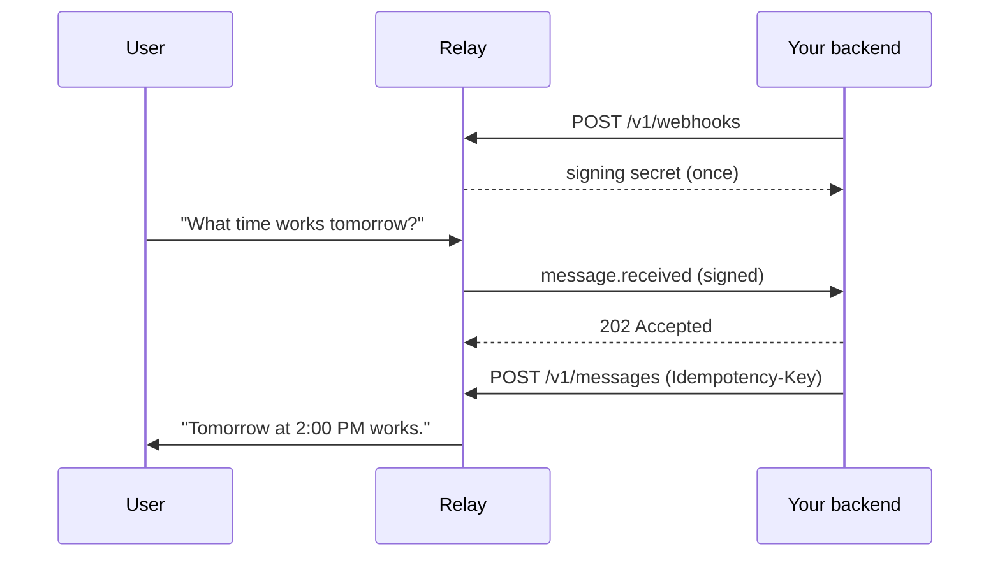

Create an agent in Relay and save the Agent Token shown once.



Set these once.

```bash
export RELAY_API_URL="https://api.relayapp.im"
export RELAY_AGENT_TOKEN="rly_live_..."
```

<Steps>
  <Step title="Register your webhook">
    ```bash
    curl -sS -X POST "$RELAY_API_URL/v1/webhooks" \
      -H "Authorization: Bearer $RELAY_AGENT_TOKEN" \
      -H "Content-Type: application/json" \
      -d '{"url":"https://agent.example/webhooks/relay"}'
    ```

    Relay returns the signing secret exactly once:

    ```json
    {
      "webhook": {
        "id": "wh_01JZWEBHOOK",
        "url": "https://agent.example/webhooks/relay",
        "events": ["message.received", "message.edited", "message.unsent", "…"],
        "enabled": true,
        "secret_prefix": "whsec_MfKQ9r8G…",
        "created_at": "2026-07-15T20:00:00.000Z",
        "updated_at": "2026-07-15T20:00:00.000Z"
      },
      "signing_secret": "whsec_..."
    }
    ```

    It is not returned by list or update requests.
  </Step>

  <Step title="Receive and verify the signed event">
    Relay sends the event envelope as the raw JSON request body with
    `webhook-id`, `webhook-timestamp`, and `webhook-signature` headers. Verify
    the signature before parsing the body, reject timestamps older than five
    minutes, store the event, and return a `2xx` quickly.

    ```json
    {
      "event_id": "evt_01JZE9M2XW",
      "event_type": "message.received",
      "agent_id": "agt_01JZRELAY",
      "created_at": "2026-07-12T01:21:03.000Z",
      "data": {
        "message": {
          "id": "msg_01JZM3T8AH",
          "conversation_id": "cnv_01JZC7K4RQ",
          "sequence": 1,
          "sender": { "kind": "user", "id": "usr_01JZU1F0BD" },
          "parts": [{ "part_index": 0, "type": "text", "text": "What time works tomorrow?" }],
          "reply_to": null,
          "fallback_text": "What time works tomorrow?",
          "status": "sent",
          "created_at": "2026-07-12T01:21:03.000Z"
        }
      }
    }
    ```

    Delivery is at least once. Deduplicate with `event_id`.
  </Step>

  <Step title="Reply">
    Derive the `Idempotency-Key` from the incoming `event_id` so retries cannot
    create a second reply.

    ```bash
    curl -sS -X POST "$RELAY_API_URL/v1/messages" \
      -H "Authorization: Bearer $RELAY_AGENT_TOKEN" \
      -H "Content-Type: application/json" \
      -H "Idempotency-Key: reply-evt_01JZE9M2XW" \
      -d '{
        "conversation_id": "cnv_01JZC7K4RQ",
        "parts": [{ "type": "text", "text": "Tomorrow at 2:00 PM works." }],
        "reply_to": { "message_id": "msg_01JZM3T8AH", "part_index": 0 }
      }'
    ```

    Relay returns `202 Accepted` with the stored message.
  </Step>
</Steps>

<Check>
The reply is in the user's thread.
</Check>

## Next steps

- [Webhooks, for verification, retries, and rotation](/guides/webhooks)
- [Sending messages, for every part type](/guides/sending-messages)
- [Streaming replies](/guides/streaming)
- [Errors](/reference/errors)
