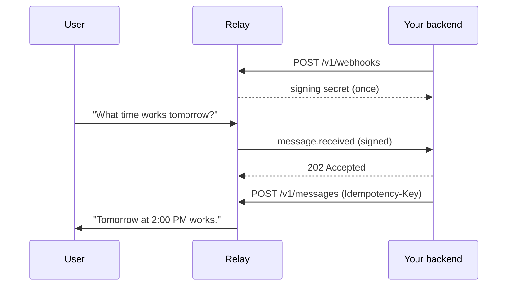

import SetupAIPrompt from "/snippets/setup-ai-prompt.mdx";

Create an agent in Relay and save the Agent Token shown once.



Set these once.

```bash
export RELAY_API_URL="https://api.relayapp.im"
export RELAY_AGENT_TOKEN="rly_live_..."
```

<Steps>
  <Step title="Hand this page to your coding agent (optional)">
    Paste this into Claude Code, Codex, or Cursor. The agent carries out every
    step below; the Agent Token is the only thing it needs from you.

    <SetupAIPrompt />

    <Info>
    **Working by hand?** Continue below; the steps are identical. Any LLM can
    also ingest [`llms-full.txt`](https://docs.relayapp.im/llms-full.txt), which
    bundles every page as one Markdown file.
    </Info>
  </Step>

  <Step title="Register your webhook">
    ```bash
    curl -sS -X POST "$RELAY_API_URL/v1/webhooks" \
      -H "Authorization: Bearer $RELAY_AGENT_TOKEN" \
      -H "Content-Type: application/json" \
      -d '{"url":"https://agent.example/webhooks/relay"}'
    ```

    Relay returns the signing secret exactly once:

    ```json
    {
      "webhook": {
        "id": "wh_01JZWEBHOOK",
        "url": "https://agent.example/webhooks/relay",
        "events": ["message.received", "message.edited", "message.unsent", "…"],
        "enabled": true,
        "secret_prefix": "whsec_MfKQ9r8G…",
        "created_at": "2026-07-15T20:00:00.000Z",
        "updated_at": "2026-07-15T20:00:00.000Z"
      },
      "signing_secret": "whsec_..."
    }
    ```

    It is not returned by list or update requests.
  </Step>

  <Step title="Receive and verify the signed event">
    Relay sends the event envelope as the raw JSON request body with
    `webhook-id`, `webhook-timestamp`, and `webhook-signature` headers. Verify
    the signature before parsing the body, reject timestamps older than five
    minutes, store the event, and return a `2xx` quickly.

    ```json
    {
      "event_id": "evt_01JZE9M2XW",
      "event_type": "message.received",
      "agent_id": "agt_01JZRELAY",
      "created_at": "2026-07-12T01:21:03.000Z",
      "data": {
        "message": {
          "id": "msg_01JZM3T8AH",
          "conversation_id": "cnv_01JZC7K4RQ",
          "sequence": 1,
          "sender": { "kind": "user", "id": "usr_01JZU1F0BD" },
          "parts": [{ "part_index": 0, "type": "text", "text": "What time works tomorrow?" }],
          "reply_to": null,
          "fallback_text": "What time works tomorrow?",
          "status": "sent",
          "created_at": "2026-07-12T01:21:03.000Z"
        }
      }
    }
    ```

    Delivery is at least once. Deduplicate with `event_id`.
  </Step>

  <Step title="Reply">
    Derive the `Idempotency-Key` from the incoming `event_id` so retries cannot
    create a second reply.

    ```bash
    curl -sS -X POST "$RELAY_API_URL/v1/messages" \
      -H "Authorization: Bearer $RELAY_AGENT_TOKEN" \
      -H "Content-Type: application/json" \
      -H "Idempotency-Key: reply-evt_01JZE9M2XW" \
      -d '{
        "conversation_id": "cnv_01JZC7K4RQ",
        "parts": [{ "type": "text", "text": "Tomorrow at 2:00 PM works." }],
        "reply_to": { "message_id": "msg_01JZM3T8AH", "part_index": 0 }
      }'
    ```

    Relay returns `202 Accepted` with the stored message.
  </Step>

  <Step title="Run the complete handler">
    The three steps above as one file: verify, store, reply.

    <CodeGroup>

    ```typescript server.ts
    import { createServer } from "node:http";
    import { Webhook } from "standardwebhooks";

    const wh = new Webhook(process.env.RELAY_SIGNING_SECRET!);
    const TOKEN = process.env.RELAY_AGENT_TOKEN!;
    const seen = new Set<string>();

    createServer(async (req, res) => {
      const body = await new Promise<string>((ok) => {
        let b = ""; req.on("data", (c) => (b += c)); req.on("end", () => ok(b));
      });
      let event: any;
      try {
        event = wh.verify(body, req.headers as Record<string, string>);
      } catch {
        res.writeHead(401).end("bad signature"); return;
      }
      res.writeHead(202).end(); // ack first, work after

      if (event.event_type !== "message.received") return;
      if (seen.has(event.event_id)) return; // at-least-once delivery
      seen.add(event.event_id);

      await fetch("https://api.relayapp.im/v1/messages", {
        method: "POST",
        headers: {
          Authorization: `Bearer ${TOKEN}`,
          "Content-Type": "application/json",
          "Idempotency-Key": `reply-${event.event_id}`,
        },
        body: JSON.stringify({
          conversation_id: event.data.message.conversation_id,
          parts: [{ type: "text", text: "Tomorrow at 2:00 PM works." }],
        }),
      });
    }).listen(8787);
    ```

    ```python server.py
    import json, os, urllib.request
    from http.server import BaseHTTPRequestHandler, HTTPServer
    from standardwebhooks import Webhook

    wh = Webhook(os.environ["RELAY_SIGNING_SECRET"])
    TOKEN = os.environ["RELAY_AGENT_TOKEN"]
    seen = set()

    class Handler(BaseHTTPRequestHandler):
        def do_POST(self):
            body = self.rfile.read(int(self.headers["Content-Length"]))
            try:
                event = wh.verify(body, dict(self.headers))
            except Exception:
                self.send_response(401); self.end_headers(); return
            self.send_response(202); self.end_headers()  # ack first

            if event["event_type"] != "message.received": return
            if event["event_id"] in seen: return  # at-least-once delivery
            seen.add(event["event_id"])

            req = urllib.request.Request(
                "https://api.relayapp.im/v1/messages",
                data=json.dumps({
                    "conversation_id": event["data"]["message"]["conversation_id"],
                    "parts": [{"type": "text", "text": "Tomorrow at 2:00 PM works."}],
                }).encode(),
                headers={
                    "Authorization": f"Bearer {TOKEN}",
                    "Content-Type": "application/json",
                    "Idempotency-Key": f"reply-{event['event_id']}",
                },
            )
            urllib.request.urlopen(req)

    HTTPServer(("", 8787), Handler).serve_forever()
    ```

    </CodeGroup>

    Send your agent a message from the Relay app. The reply lands in the thread.
  </Step>

  <Step title="Ask your agent to audit the result (optional)">
    ````markdown Copy this prompt
    Review my Relay integration against https://docs.relayapp.im/quickstart.md
    and https://docs.relayapp.im/guides/webhooks.md. Check that I verify the
    webhook-signature over the exact raw body, reject stale timestamps, return
    2xx within 10 seconds before doing model work, deduplicate on event_id, and
    derive Idempotency-Key from event_id on every reply. Report anything that
    does not match, with the file and line.
    ````
  </Step>
</Steps>

<Check>
The reply is in the user's thread.
</Check>

## If it fails

| Symptom | Cause and fix |
| --- | --- |
| `bad signature` | You verified a parsed or re-serialized body. Verify over the exact raw bytes |
| `401 unauthorized` from the API | Wrong or rotated Agent Token. Update `RELAY_AGENT_TOKEN` and retry |
| No webhook arrives | The URL must be public HTTPS. Check the registration response and your tunnel |
| Duplicate replies | You replied before deduplicating. Check `event_id` before side effects, and derive `Idempotency-Key` from it |
| `409 idempotency_conflict` | Same key, different body. Reuse the key only for the identical reply |

## Next steps

- [Webhooks, for verification, retries, and rotation](/guides/webhooks)
- [Sending messages, for every part type](/guides/sending-messages)
- [Streaming replies](/guides/streaming)
- [Errors](/reference/errors)
